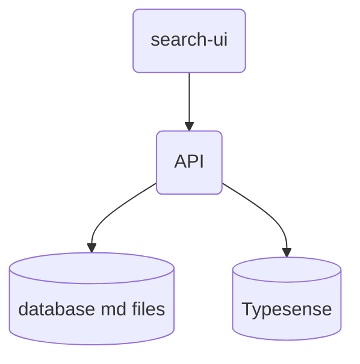
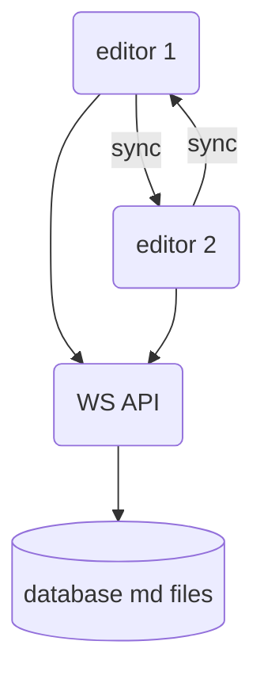

# Search UI

## Get started

To run this project locally, install the dependencies and run the local server:

```sh
npm install
npm start
```

Alternatively, you may use [Yarn](https://http://yarnpkg.com/):

```sh
yarn
yarn start
```

Open http://localhost:3000 to see your app.


## Architecture

Search UI SPA

Typesense - search engine backen

Backend API proxy for auth + CORS


UI SPA -> API -> Typesense








