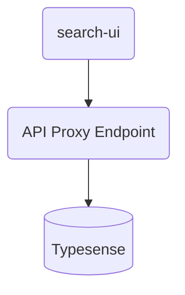
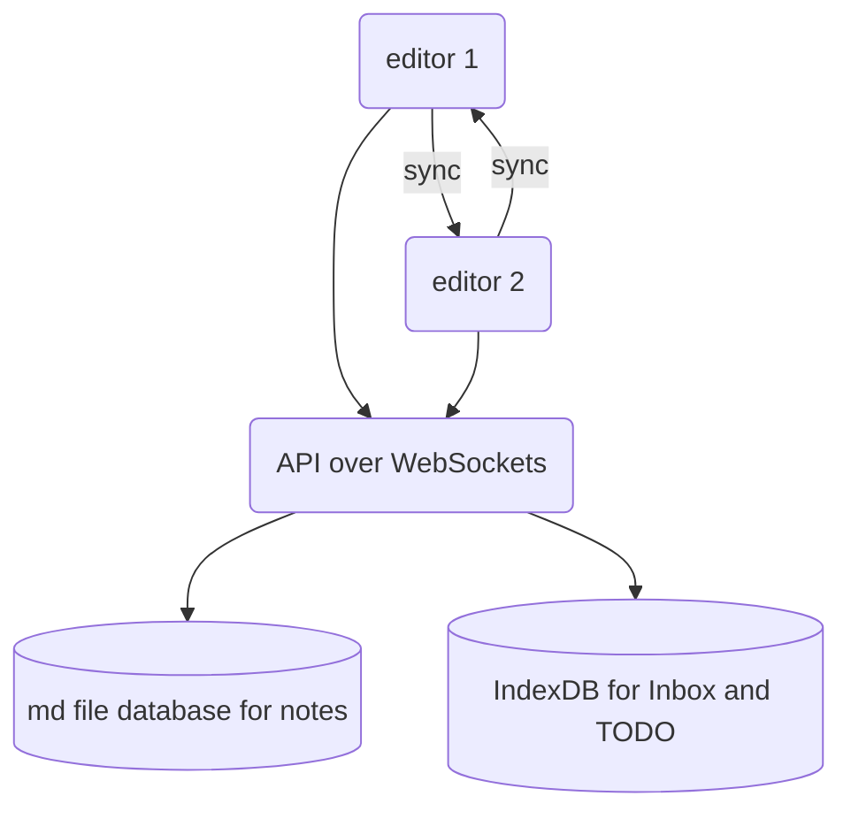

# Osobisty Search UI

This THE desktop web UI for Osobisty. Search results and view/edit are the main views.

The intention is to build a UI that optimised for manageing all personal knowledge centrally following the Zettlekasten style of note taking. All notes content managed as MD + Front Matter for maximum portability.


## Why build this?

- High partability of content - Don't want content locked into the likes of Notion or Roam.
- Optimised to get out of the way - VS Code + Foam bubble is too clunky, temperamental, and poorly integrated with all the extentions needed to make it work. Not all the extensions are available Codespaces aka via browser
- Access without syncing content locally
- Ability to have search with higjly integrated edit for speed of find/navigating and capturing thoughts/notes.


## Get started

To run this project locally, install the dependencies and run the local server:

```sh
npm install
npm start
```

Alternatively, you may use [Yarn](https://http://yarnpkg.com/):

```sh
yarn
yarn start
```

Open http://localhost:3000 to see your app.


## Architecture

Search-UI - Search UI SPA

Typesense - search engine backend

API Proxy Endpoint - a straight proxy to the Typesense API that adds OAuth + CORS.



## Editor UI Architecture

CRDT based live collaboration architecture for syncing to the backend and multiple instances.

CRDT rather than Operational Transformation (OT) because that's what Yjs supports and it's the most mature library I can find to solve for my need.

Text Editor stack - SlateJS + PlateJS + Yjs (Slate-yjs) + remark-slate




